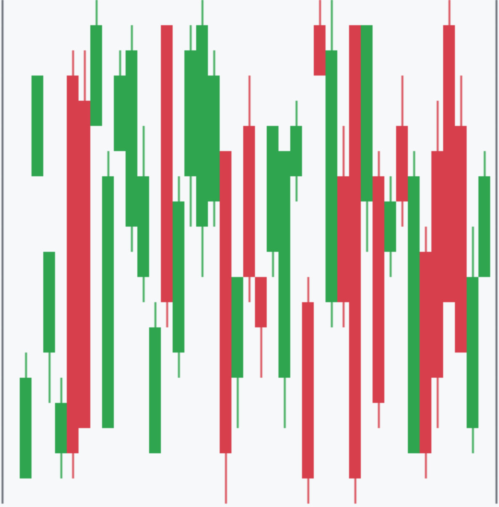

# 📊 retrograph

一个用于 Node.js 应用程序的多功能 CLI 风格图表可视化工具

[English](README.md) | [한국어](README.ko.md) | [日本語](README.ja.md) | [中文](README.zh.md)

## 🚀 安装

使用 npm 安装包：

```bash
npm install retrograph
```

## Example Result



## 使用方法

### 单个图表

要创建单个图表，请使用 createChart 函数：

```typescript
import { createChart } from "retrograph";

const candleData: OHLC[] = [
  [100, 110, 90, 105],
  [105, 115, 95, 108],
  [108, 120, 100, 112],
];

const candleChart = createChart("candle", candleData, {
  width: 40,
  height: 10,
}); // 选项是可选的
```

创建一个 OHLC 结构的 candleData 数组。
调用 createChart，将"candle"作为类型，传入 candleData 和宽度、高度等选项。
在任何您想显示图表的地方使用。

#### 使用示例

```typescript
console.log(candleChart);
```

### 多个图表

要创建多个图表，请使用 createCharts 函数：

```typescript
import { createCharts, ChartConfiguration, ChartType } from "retrograph";

const chartConfigurations: ChartConfiguration<ChartType>[] = [
  { type: "candle", data: candleData },
  { type: "bar", data: barData },
  { type: "line", data: lineData },
  { type: "scatter", data: scatterData },
  { type: "histogram", data: histogramData },
];

const compositeChart = createCharts(chartConfigurations, 2); // 选项是可选的
```

使用此数组和间距值调用 createCharts。

## 📈 支持的图表类型

| 图表类型             | 状态          |
| -------------------- | ------------- |
| 蜡烛图 ("candle")    | ✅ 已完全实现 |
| 柱状图 ("bar")       | 🚧 尚未实现   |
| 线图 ("line")        | 🚧 尚未实现   |
| 散点图 ("scatter")   | 🚧 尚未实现   |
| 直方图 ("histogram") | 🚧 尚未实现   |

## API

### createChart\<T extends ChartType\>(type: T, data: ChartDataMap[T], options?: ChartOptions): string

创建指定类型的单个图表。

- type: 要创建的图表类型。
- data: 与图表类型匹配的数据。
- options: 图表的可选配置。

### createCharts(charts: ChartConfiguration\<ChartType\>[], spacing: number = 1, options?: ChartOptions): string

创建多个图表并将它们组合成单个输出。

- charts: 图表配置数组。
- spacing: 图表之间的换行数（默认值：1）。
- options: 应用于所有图表的可选配置。

### ChartOptions

ChartOptions 接口包括以下属性：

| 属性       | 类型   | 默认值     | 描述                       |
| ---------- | ------ | ---------- | -------------------------- |
| width      | number | 80         | 图表的宽度                 |
| height     | number | 20         | 图表的高度                 |
| color      | object | -          | 图表的颜色选项             |
| color.up   | string | '\x1b[31m' | 用于上升趋势的颜色（红色） |
| color.down | string | '\x1b[32m' | 用于下降趋势的颜色（绿色） |

所有属性都是可选的。颜色值是用于终端颜色的 ANSI 转义代码。

注意：默认颜色在`colors.ts`文件中定义：

- 上升颜色（红色）：`\x1b[31m`
- 下降颜色（绿色）：`\x1b[32m`

## 示例

查看存储库中的 examples 文件夹以获取更详细的使用示例：

- single_chart.ts: 演示创建单个蜡烛图。（已完全实现）
- composite_chart.ts: 展示如何在一个输出中创建多个图表。（部分实现，需要更新）
- all_chart_types.ts: 显示所有支持的图表类型的示例。（部分实现，需要更新）

## 许可证

本项目采用 MIT 许可证。
